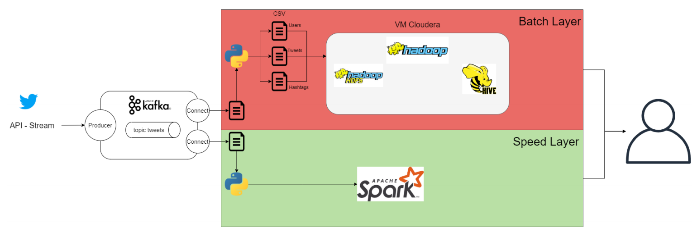
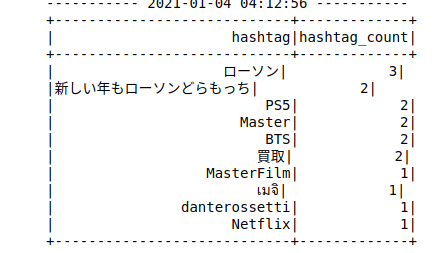
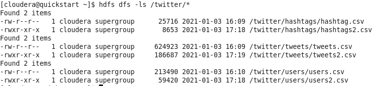
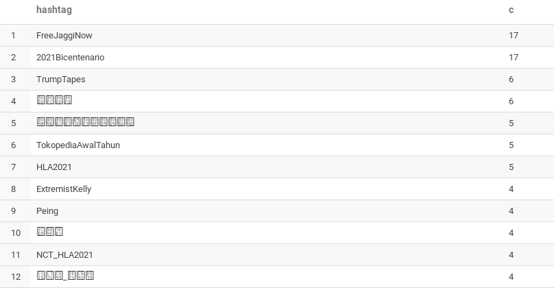
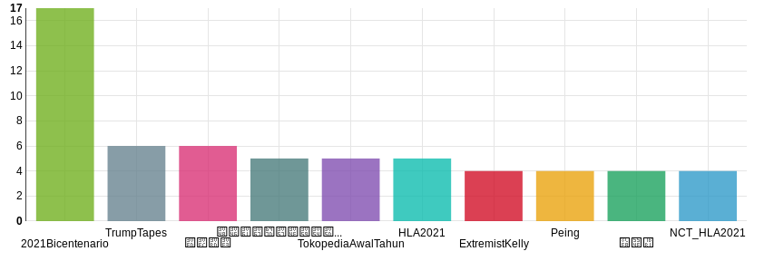
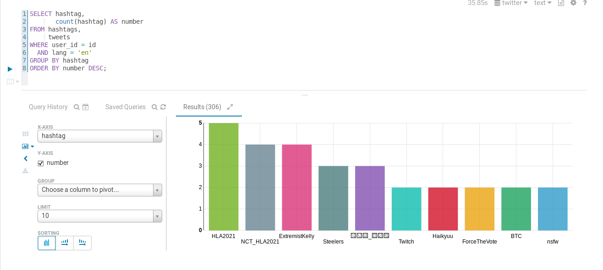

# Twitter Analysis

Après une mauvaise manipulation, j'ai supprimé les scripts Python quio permettaient nottament de faire les liaisons entre les différentes partie de l'architecture.



## Récupération de Tweets

Nous récupérons des tweets en utilisant l'API v2 stream conformément à la documentation de Twitter.

> curl -X GET -H "Authorization: Bearer $BEARER_TOKEN" "https://api.twitter.com/2/tweets/sample/stream"

et on obtient un stream de tweets de ce type :

```json
{"data":{"id":"1347553853462507520","text":"RT @MarouV2: Bon bah on l’avait sentit ... Reconfinement total pour bientôt ✔️ https://t.co/014j0fSYKa"}}"
```

Cependant nous souhaitions plus d'information et avons utilisé des requêtes avancées de l'API afin de sélectionner les données souhaitées :

> curl -m 60 -X GET -H "Authorization: Bearer $BEARER_TOKEN" "https://api.twitter.com/2/tweets/sample/stream?expansions=author_id&tweet.fields=entities,created_at,lang,public_metrics&user.fields=name,public_metrics,verified"

ce qui renvoit des json du type :

```json
{"data":{"author_id":"1257274220591173634","id":"1347557737371201542","text":"3)Qui fût l’entraîneur amenant Lille, promu, à la 3e place lors de la saison 2000-2001 ?","created_at":"2021-01-08T14:56:15.000Z","lang":"fr","public_metrics":{"retweet_count":0,"reply_count":1,"like_count":0,"quote_count":0}},"includes":{"users":[{"id":"1257274220591173634","public_metrics":{"followers_count":504,"following_count":44,"tweet_count":307,"listed_count":4},"verified":false,"name":"La Causerie","username":"La_Causerie_"}]}}
```

Ainsi nous récupérons un Json plus complet en terme d'information ce qui permettra de faire des traitements plus complexes par la suite. Entre autre nous récupérons la liste des hashtags, lma langue du tweet, des métriques publics (nombre de retweets, d'abonnées, etc...). D'autre part nous utilisons le paramètre -m 60 afin de stopper le flux de tweets proprement entre 2 tweets et non au milieu d'un Json ce qui causerait une erreur dans la suite du pipeline.

## Kafka

Nous avons décidé d'utiliser les technologies vues en cours afin d'avoir une architecture scalable à grande échelle et prête pour du traitement big-data bien que dans notre installation cela ne soit pas optimisé. De ce fait, l'étape suivante est d'envoyer le flux de tweets dans un producer Kafka d'un topic *tweets* de messages Json. Nous avons utilisé un topic sans réplication ni partition pour simplifier le prototype mais cela pourrait être changé lors du passage à l'échelle.

Afin de pouvoir par la suite faire des traitements de type SMT dans un sink Kafka connect, nous devons définir le schéma du Json. Cela a été fait à la main car aucun outil ne semble permettre cette automatisation. Nous ajoutons donc avant chaque message le schéma et une accolade supplémentaire à la fin. Cela est réalisé via le traitement sed suivant :

```bash
curl ... | sed -e "s/}]}}/}]}}}/;s/^/$SCHEMA/" | ./kafka_2.12-2.6.0/bin/kafka-console-producer.sh --broker-list localhost:9094 --topic tweets
```

où la variable $SCHEMA contient le schema json contenu dans le fichier *schema.json*.

### Kafkaz Connect

Afin de connecter le topic Kafka au différentes Layer, nous avons décidé d'utiliser Kafka Connect ce qui permet d'utiliser une technologie du cours et permet de facilement visualiser la sortie de Kafka. Cependant des outils adaptés permettant d'établir la connection avec les layer auraient été beaucoup plus pertinents.

Ainsi nous avons un sink tweets qui conserve l'ensemble du tweet pour la batch layer :

```text
name=local-file-sink-tweets
connector.class=FileStreamSink
tasks.max=1
file=/home/pe/Documents/3A/big-data/kafka-connect/tweets
topics=tweets
consumer.auto.offset.reset=latest

errors.tolerance=all
errors.log.enable=true
errors.log.include.messages=true
```

Le traitement des erreur permissif est nécessaire car le flux de tweets causait invariablement une erreur au bout de 20 secondes alors que tous les tweets étaient correctement formés.

D'autre part le sink hashtag utilisée des SMT:

```text
name=local-file-sink-hashtags
connector.class=FileStreamSink
tasks.max=1
file=/home/pe/Documents/3A/big-data/kafka-connect/hashtags
topics=tweets
consumer.auto.offset.reset=latest

errors.tolerance=all
errors.log.enable=true
errors.log.include.messages=true

transforms=t1,t2,t3
transforms.t1.type=org.apache.kafka.connect.transforms.ExtractField$Value
transforms.t1.field=data
transforms.t2.type=org.apache.kafka.connect.transforms.ExtractField$Value
transforms.t2.field=entities
transforms.t3.type=org.apache.kafka.connect.transforms.ExtractField$Value
transforms.t3.field=hashtags
```

Ce qui permet de sélectionner récursivement le contenu du champ Json hashtags.

## Speed Layer

Dans notre installation, nous nous servions du fichier d'output du sink hashtag en redirigeant sont contenu vers un script *conection.py* ainsi :

```bash
tail -F hashtags | python connection.py
```

Entrée représentative du script :

```bash
null
null
null
[Struct{start=65,end=73,tag=HadesOC}, Struct{start=74,end=84,tag=HadesGame}]
```

Ce script Python parsait l'entrée standard afin de retirer les valeurs null et d'extraitre les hashtags, via des expressions régulières, qu'il envoyait par connection tcp à pySpark qui tournait sur un notebook Jupyter.

PySpark faisait ensuite un traitement simple qui consistait à établir un classement des 10 hashatgs les plus répendus dans le flux de tweets.



## Batch Layer

Concernant la Batch Layer, nous transformions la sortie du Sink Kafka Connect via un script *create_csv.py* qui permettait de parser via des expressions régulières les données souhaitées pour le traitement. Cela permettait de réaliser 3 fichiers csv: 1 pour les utilisateurs, 1 pour les hashtags et 1 pour les tweets.

Nous souhaitions réaliser le traitement par batch en utilisant Hadoop ce qui permet de mettre en oeuvre les technologies vues en cours et corrsepond à une application big data pouvant passer à l'échelle. Pour ce faire nous avons utilisé une machine virtuelle Cloudera Quickstart qui fait tourner une installation de Hadoop.

Dans ce projet nous transferions donc les données csv vers hadoop à la main, ce qui pourrait s'automatiser toutes les quelques minutes dans une installation de production.

Ainsi on ajoute nos données dans le hdfs via la commande:

```bash
hdfs dfs -put ./hashtags.csv /twitter/hashtags/
```



Ensuite avec un client Hive, on peut créer une base SQL depuis le fichier ainsi :

```SQL
CREATE EXTERNAL TABLE IF NOT EXISTS hashtags (user_id STRING, hashtag STRING) ROW FORMAT DELIMITED FIELDS TERMINATED BY ',' STORED AS TEXTFILE LOCATION '/twitter/hashtags';
```

Par la suite on peut réaliser des requêtes même complexes facilement via Hive, ce qui produira des jobs Map-Reduce dans Hadoop.

### Exemples

#### Classe les hashtags en fonction de leur fréquence d'apparitions dans les tweets du HDFS

```SQL
SELECT hashtag, count(hashtag) AS c FROM hashtags GROUP BY hashtag ORDER BY c DESC;
```

##### Visuliastions dans Hive






#### Classe les hashtags des tweets en anglais

```SQL
SELECT hashtag, count(hashtag) AS number FROM hashtags, tweets WHERE user_id = id AND lang = 'en' GROUP BY hashtag ORDER BY number DESC;
```

##### Visuliastions dans Hive


